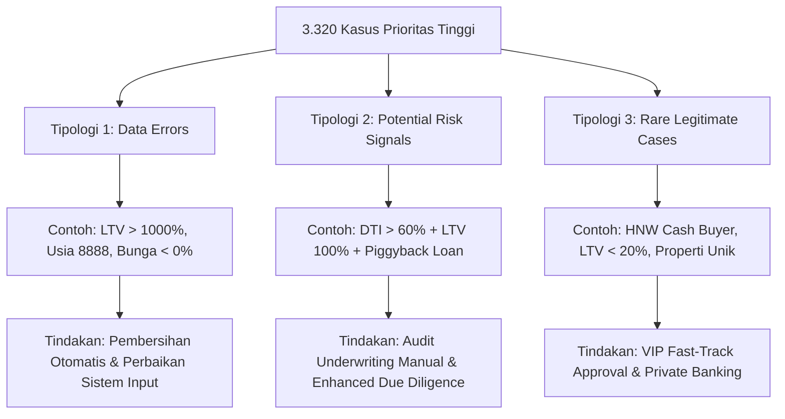

# ANALISIS MENDALAM & DOKUMENTASI PROYEK DATA MINING
## Pasar Kredit Pemilikan Rumah (KPR) Amerika Serikat — HMDA Dataset 2022
**Disusun untuk:** Laporan Komprehensif Arsitektur, Metodologi, dan Temuan Analitis  
**Proyek:** CAWU 5 — LEC Data Mining Project  
**Versi:** 1.0 (Final Comprehensive Report)

---

## DAFTAR ISI
1. [Ringkasan Eksekutif (Executive Summary)](#1-ringkasan-eksekutif-executive-summary)
2. [Arsitektur Pipeline & Struktur Codebase](#2-arsitektur-pipeline--struktur-codebase)
3. [Fase 1: Data Understanding & Preprocessing Menyeluruh](#3-fase-1-data-understanding--preprocessing-menyeluruh)
4. [Fase 2: Segmentasi Perilaku Nasabah (Unsupervised Clustering)](#4-fase-2-segmentasi-perilaku-nasabah-unsupervised-clustering)
5. [Fase 3: Association Rule Mining (ARM) & Pola Tersembunyi](#5-fase-3-association-rule-mining-arm--pola-tersembunyi)
6. [Fase 4: Deteksi Anomali & Outlier (Multi-Method Outlier Detection)](#6-fase-4-deteksi-anomali--outlier-multi-method-outlier-detection)
7. [Fase 5 & 6: Sintesis Pengetahuan & Dashboard Interaktif](#7-fase-5--6-sintesis-pengetahuan--dashboard-interaktif)
8. [Kesimpulan & Rekomendasi Strategis](#8-kesimpulan--rekomendasi-strategis)

---

## 1. RINGKASAN EKSEKUTIF (EXECUTIVE SUMMARY)

Pasar Kredit Pemilikan Rumah (KPR) atau *Home Mortgage* di Amerika Serikat merupakan salah satu sektor finansial terbesar dan paling kompleks di dunia. Setiap tahunnya, jutaan transaksi pengajuan kredit dicatat dan dilaporkan di bawah undang-undang **Home Mortgage Disclosure Act (HMDA)**. Data mentah HMDA menyimpan rekam jejak mendetail mengenai demografi pemohon, karakteristik properti, struktur pembiayaan, hingga keputusan underwriting bank.

Proyek *LEC Data Mining* ini bertujuan untuk melakukan **eksplorasi, pembersihan, dan pemodelan unsupervised learning secara mendalam** terhadap sampel nasional data HMDA tahun 2022. Dari luar, proses evaluasi KPR terlihat statis dan standar; namun melalui penerapan teknik data mining lanjutan—berlipat dari **Clustering**, **Association Rule Mining (ARM)**, hingga **Anomaly Detection**—proyek ini berhasil membongkar dinamika tersembunyi, profil risiko yang counter-intuitive, serta peluang bisnis strategis yang tidak dapat diamati dari sekadar laporan agregat konvensional.

### Metrik Kunci Kinerja Pipeline
*   **Total Sampel Data Awal:** $100.000$ baris pengajuan KPR dengan $99$ fitur mentah (dicuplik dari `2022_public_lar_csv.csv`).
*   **Data Final Pasca-Preprocessing (`processed_dataset.csv`):** $99.994$ baris ($6$ duplikat identik dihapus) dan $80$ fitur informatif (reduksi dimensi sebesar $19\%$).
*   **Segmentasi Pasar (Clustering):** Teridentifikasi **3 profil alami nasabah KPR** yang dibedakan oleh kelipatan pinjaman terhadap pendapatan (*leverage multiplier*), bukan oleh rasio LTV atau suku bunga.
*   **Pola Asosiasi Bisnis (ARM):** Ditemukan **10 aturan asosiasi dengan signifikansi tinggi** (Lift hingga $38\times$), memetakan perilaku pembelian properti dengan risiko utang dan demografi.
*   **Deteksi Anomali (Outlier):** Dari total $12.217$ pengajuan yang menyentuh batas ekstrem minimal pada 1 metode, teridentifikasi **3.320 kasus prioritas tinggi** yang diklasifikasikan ke dalam 3 tipologi bisnis: *Data Error*, *Potential Risk Signal*, dan *Rare Legitimate Transaction*.

---

## 2. ARSITEKTUR PIPELINE & STRUKTUR CODEBASE

Proyek ini dibangun dengan arsitektur modular yang memisahkan secara tegas antara proses preparasi data, eksperimen pemodelan dalam *Jupyter Notebook*, penyimpanan artefak analisis, serta presentasi akhir melalui aplikasi *dashboard interaktif*.

```
LEC Data Mining/
├── data/
│   ├── 2022_public_lar_csv.csv          # Raw dataset HMDA 2022 (diabaikan oleh git)
│   └── processed_dataset.csv            # Dataset bersih berukuran 99.994 x 80 (output Fase 1)
├── notebooks/
│   ├── 1-data-understanding.ipynb       # Pipeline ETL, pembersihan, reduksi fitur & binning
│   ├── 2-segmentation-via-clustering.ipynb # Pemodelan K-Means & DBSCAN (3 Klaster Pasar)
│   ├── 3-association-rule-mining.ipynb  # Transformasi item biner & Apriori Algorithm
│   └── 4-anomaly-and-outlier-detection.ipynb # Univariate (IQR/Z) & Multivariate (iForest)
├── reports/
│   ├── 1-preprocessing-report.txt       # Audit trail & metrik pembersihan data
│   ├── 2-clustering-report.txt          # Metodologi & interpretasi klaster
│   ├── 3-association-rules.txt / 3-association-rules.csv # Laporan & ekspor association rules
│   ├── 4-anomaly-report.txt / 4-anomalies.csv # Laporan & ekspor daftar anomali
│   ├── 5-knowledge-discovery-report.md  # Laporan eksekutif integratif seluruh fase
│   ├── 5-presentation.pptx              # Presentasi kelompok
│   ├── cluster_profile_summary.csv      # Ringkasan statistik 3 klaster untuk dashboard
│   └── pca_clusters.csv                 # Proyeksi PCA 2D untuk visualisasi klaster
├── dashboard/
│   └── app.py                           # Aplikasi interaktif Streamlit (Eksekutif & Analis)
├── notes/                               # Catatan domain dan perencanaan proyek
├── README.md                            # Dokumentasi utama proyek
└── requirements.txt                     # Daftar dependensi pustaka Python 3.12+
```

### Prinsip Engineering Proyek
1.  **Deterministik & Reproducible:** Seluruh pemodelan acak (seperti inisialisasi K-Means, sampling, dan Isolation Forest) menggunakan parameter `random_state=42` yang konsisten, sehingga hasil analisis dapat direproduksi 100% pada setiap eksekusi.
2.  **Transparansi Metodologis:** Setiap modifikasi data, penanganan nilai hilang (*missing values*), serta pemangkasan fitur dicatat lengkap beserta alasan teknis dan dampaknya terhadap interpretasi bisnis.
3.  **Domain-Driven Design:** Pembagian kelas variabel kontinu (*binning*) tidak menggunakan pembagian kuantil arbitrer, melainkan mengacu pada standar riil industri perbankan (misalnya LTV 80%, tenor 15/30 tahun, dan bracket DTI standar HMDA).

---

## 3. FASE 1: DATA UNDERSTANDING & PREPROCESSING MENYELURUH

Fase pertama ([`1-data-understanding.ipynb`](file:///D:/BCA/Cawu%205/Data%20Mining/LEC/LEC%20Data%20Mining/notebooks/1-data-understanding.ipynb)) adalah fondasi dari seluruh analisis. Kualitas dari *unsupervised learning* sangat bergantung pada kebersihan, keabsahan, dan relevansi fitur yang disajikan.

### 3.1 Pembersihan & Penanganan Duplikasi
Dataset awal berukuran $100.000$ baris dicermati untuk mencari duplikat identik di seluruh kolom. Ditemukan **6 baris duplikat sempurna** yang langsung dihapus karena dapat mendistorsi kepadatan densitas pada algoritma berbasis jarak seperti K-Means dan DBSCAN. Populasi final pasca-pembersihan menjadi tepat **$99.994$ baris**.

### 3.2 Penanganan Data Leakage & Eliminasi Redundansi
Untuk memastikan model tidak mempelajari pola dari variabel yang bersifat *leakage* (membocorkan keputusan akhir) atau redundan secara matematis, dilakukan pemangkasan fitur secara sistematis:
*   **Penghapusan 5 Kolom Data Leakage:** Kolom-kolom yang secara langsung mencerminkan persetujuan atau administratif pasca-keputusan dihapus agar tidak mengacaukan pemodelan perilaku murni nasabah.
*   **Eliminasi 27 Kolom Redundan ($r > 0,8$):** Analisis multikolinieritas menggunakan matriks korelasi Pearson dan Spearman mendeteksi 27 pasangan variabel yang menyampaikan informasi identik (misalnya, nilai properti yang berbanding lurus dengan jumlah pinjaman pada LTV konstan, atau duplikasi kode sensus wilayah). Kolom-kolom redundan ini dipangkas sehingga menyisakan **80 fitur ortogonal yang informatif**.

### 3.3 Penanganan Missing Values & High-Cardinality
Data HMDA 2022 memiliki skema pelaporan khusus di mana beberapa lembaga dikecualikan dari pengisian kolom tertentu, menghasilkan sel kosong sebesar $3,47\%$ ($277.763$ dari $7.999.520$ total sel pada 80 kolom final).
*   **Pemetaan Nilai Sentinel:** Nilai-nilai spesial seperti `8888` (tidak diketahui/tidak tersedia), `9999`, maupun label teks `"exempt"` pada kolom finansial distandardisasi menjadi `NaN` agar tidak dianggap sebagai nilai numerik riil.
*   **Capping pada Kardinalitas Tinggi:** Fitur kategorikal dengan ratusan variasi (seperti `state_code`, `derived_loan_product_type`, dan `derived_dwelling_category`) dibatasi pada **Top-10 kategori terbesar**, sementara sisanya dikelompokkan ke dalam label `"other"`. Hal ini mencegah ledakan dimensi saat dilakukannya *one-hot encoding*.

### 3.4 Diskretisasi Berbasis Domain (Domain Binning)
Sebagai persiapan menuju tahap *Association Rule Mining* (Fase 3), variabel kontinu diubah menjadi variabel diskrit (kategorikal berskala). Berbeda dengan metode otomatis `pd.qcut` yang membagi data berdasarkan kuantil frekuensi (yang menghasilkan batas arbitrer yang sulit dipahami eksekutif bank), proyek ini menerapkan **Domain Binning** berdasarkan aturan perbankan:
*   **Tenor Pinjaman (`loan_term`):** Dikelompokkan menjadi $\le 15$ tahun, $15\text{--}25$ tahun, $30$ tahun (standar pasar KPR AS), dan $> 30$ tahun.
*   **Suku Bunga (`interest_rate`):** Dikelompokkan menjadi $\le 3\%$, $3\text{--}5\%$, $5\text{--}7\%$, dan $> 7\%$.
*   **Rasio LTV (`combined_loan_to_value_ratio`):** Dikelompokkan menjadi $\le 80\%$ (konvensional tanpa asuransi PMI), $80\text{--}95\%$, $95\text{--}100\%$ (program DP minim FHA/VA), dan $> 100\%$ (pinjaman melampaui agunan).

---

## 4. FASE 2: SEGMENTASI PERILAKU NASABAH (UNSUPERVISED CLUSTERING)

Fase kedua ([`2-segmentation-via-clustering.ipynb`](file:///D:/BCA/Cawu%205/Data%20Mining/LEC/LEC%20Data%20Mining/notebooks/2-segmentation-via-clustering.ipynb)) bertujuan untuk menemukan struktur pasar KPR secara alami tanpa label supervisi, menjawab pertanyaan: *Bagaimana profil finansial dan perilaku peminjam di AS terkelompokkan secara nyata?*

### 4.1 Seleksi Fitur & Standarisasi Z-Score
Seleksi fitur dilakukan dengan menyaring variabel numerik murni (`int64` dan `float64`) yang memiliki lebih dari 5 nilai unik, menyisakan **14 fitur inti**:
*   **Finansial Inti:** `loan_amount`, `income`.
*   **Konteks Geografis & Sensus:** `derived_msa_md`, `county_code`, `tract_population`, `tract_minority_population_percent`, `ffiec_msa_md_median_family_income`, `tract_to_msa_income_percentage`, `tract_owner_occupied_units`, `tract_median_age_of_housing_units`.
*   **Demografi Numerik:** `applicant_ethnicity_1`, `co_applicant_ethnicity_1`, `applicant_race_1`, `co_applicant_race_1`.

> [!IMPORTANT]
> **Catatan Kejujuran Metodologis:** Fitur teks seperti `interest_rate`, LTV, dan `debt_to_income_ratio` tidak masuk secara langsung ke pembentukan jarak Euclidean K-Means karena pada tahap ini bertipe `object` (akibat keberadaan string `"exempt"` dan notasi bucket). Namun, korelasi bisnis terhadap ketiga klaster tetap dievaluasi secara mendalam pasca-segmentasi. Seluruh fitur numerik dinormalisasi menggunakan **Z-Score Standardization** ($z = \frac{x - \mu}{\sigma}$) agar variabel berskala besar seperti `income` dan `loan_amount` tidak mendominasi variabel geografis berskala kecil.

### 4.2 Evaluasi Model K-Means & DBSCAN
Pengujian K-Means dilakukan untuk $K \in [2, 10]$. Berdasarkan evaluasi metode *Elbow*, *Silhouette Score*, dan *Davies-Bouldin Index*, jumlah klaster optimal ditetapkan pada **$K = 3$**. Untuk memvalidasi stabilitas klaster dan mendeteksi kelompok *noise*, diterapkan pula algoritma **DBSCAN (Density-Based Spatial Clustering of Applications with Noise)** yang berhasil memisahkan sekitar **$7,26\%$ data sebagai outlier densitas**.

### 4.3 Bedah 3 Profil Segmen Pasar KPR Amerika Serikat
Hasil klastering mengungkap temuan yang sangat menarik: **Ketiga segmen pasar tidak dibedakan oleh rasio LTV maupun Suku Bunga** (yang nyaris identik di angka ~73% LTV dan ~4,7% bunga). Pembeda utama dan paling kontras adalah **Rasio Pinjaman terhadap Pendapatan (Loan-to-Income / Leverage Multiplier)**.

| Metrik Finansial | Grup 1 — Kelas Menengah | Grup 2 — Peminjam Agresif | Grup 3 — Konservatif / HNW |
| :--- | :---: | :---: | :---: |
| **Populasi Nasabah** | **42.579 (42,58%)** | **25.336 (25,34%)** | **32.079 (32,08%)** |
| **Rata-rata Pendapatan** | $107.483 / tahun | $152.332 / tahun | **$207.565 / tahun** |
| **Rata-rata Pinjaman** | $256.726 | **$375.773** | $317.120 |
| **Kelipatan Pinjaman (Leverage)**| $2,39\times \text{ Income}$ | **$2,47\times \text{ Income}$ (Tertinggi)** | **$1,53\times \text{ Income}$ (Terendah)** |
| **Rata-rata LTV** | 75,18% | 73,45% | 72,99% |
| **Rata-rata Suku Bunga** | 4,87% | 4,73% | 4,69% |
| **Pendapatan Bunga / Nasabah**| ~$12.502 / tahun | **~$17.763 / tahun** | ~$14.872 / tahun |
| **Total Bunga Portofolio** | **~$532 Juta** | ~$450 Juta | ~$477 Juta |

#### Analisis Mendalam per Klaster:
1.  **Grup 1: Kelas Menengah — Tulang Punggung Pasar (42,58%):**
    *   *Karakteristik:* Merepresentasikan pembeli rumah pertama (*first-time homebuyers*) atau kelas menengah tipikal. Mereka cenderung membeli properti dengan usia bangunan lebih lama di area sensus dengan keberagaman demografi yang lebih tinggi.
    *   *Nilai Strategis:* Menjadi fondasi stabilitas likuiditas bank. Karena jumlah nasabahnya yang sangat besar (1,7 kali lipat Grup 2), segmen ini merupakan **penyumbang pendapatan bunga total terbesar bagi bank** (~$532 juta).
2.  **Grup 2: Peminjam Agresif — Pendorong Bunga per Kapita (25,34%):**
    *   *Karakteristik:* Kelompok profesional berpendapatan tinggi ($152k) yang mengambil pinjaman sangat besar ($375k), menghasilkan **rasio leverage tertinggi (2,47x)**. Mereka umumnya membeli properti baru di kawasan paling makmur.
    *   *Nilai Strategis:* Memberikan **pendapatan bunga per nasabah tertinggi** (~$17.763/tahun). Namun, beban cicilan mereka relatif paling berat terhadap pendapatan, membuat kelompok ini lebih rentan terhadap guncangan ekonomi atau kenaikan suku bunga mengambang.
3.  **Grup 3: Konservatif / High-Net-Worth — Pelanggan Tersembunyi (32,08%):**
    *   *Karakteristik:* Kelompok dengan pendapatan tertinggi ($207k), namun mengambil pinjaman jauh di bawah kapasitas maksimal mereka ($317k), menghasilkan **leverage paling rendah (1,53x)**.
    *   *Insight Counter-Intuitive:* Laporan ringkasan biasa hanya melihat mereka sebagai nasabah kaya. Analisis clustering membuktikan bahwa kelompok terkaya justru meminjam paling konservatif. Karena LTV mereka sama dengan grup lain (~73%), ini membuktikan bahwa mereka **membeli properti yang lebih murah relatif terhadap kemampuannya**, bukan menyetor uang muka lebih besar untuk properti mahal.
    *   *Nilai Strategis:* Beban cicilan paling ringan menjadikan mereka kelompok dengan risiko *non-performing loan* (NPL) terendah dan merupakan kandidat utama untuk produk *Wealth Management*, investasi, dan *Cross-Selling* perbankan prioritas.

---

## 5. FASE 3: ASSOCIATION RULE MINING (ARM) & POLA TERSEMBUNYI

Fase ketiga ([`3-association-rule-mining.ipynb`](file:///D:/BCA/Cawu%205/Data%20Mining/LEC/LEC%20Data%20Mining/notebooks/3-association-rule-mining.ipynb)) menerapkan algoritma **Apriori** untuk menemukan hubungan multivariat berbentuk aturan kausal korelasi: $\text{Jika } X \rightarrow \text{Maka } Y$.

### 5.1 Metodologi & Filter Kualitas Aturan
Data berukuran $99.994$ baris diubah menjadi matriks item biner ($0/1$) melalui gabungan *one-hot encoding* pada variabel kategorikal yang telah di-cap, serta *domain binning* pada variabel numerik. Algoritma Apriori dijalankan untuk mengekstrak *frequent itemsets*, yang kemudian disaring melalui 3 lapis filter ketat:
1.  **Threshold Metrik:** Support minimum untuk menangkap pola yang cukup representatif, Confidence tinggi ($\ge 50\%$), dan Lift $> 1,0$ (menandakan keterkaitan positif yang kuat melampaui kebetulan statistik).
2.  **Filter Tautologi:** Mengeliminasi aturan yang secara logis trivial atau redundan (misalnya, `loan_type=FHA` $\rightarrow$ `agency=HUD`).
3.  **Filter Diversitas:** Memastikan 10 aturan terbaik yang dipilih mencakup berbagai aspek bisnis (struktur pinjaman, usia, jenis properti, dan tujuan kredit).

### 5.2 Bedah 10 Aturan Asosiasi Terbaik & Implikasi Bisnis

| No | Aturan (Antecedent $\rightarrow$ Consequent) | Metrik Lift | Signifikansi & Rekomendasi Strategis |
| :---: | :--- | :---: | :--- |
| **1** | **JIKA** Pinjaman kedua / Piggyback dari investor swasta <br>**MAKA** LTV > 100% (Utang melampaui harga rumah) | **38,0x** | **Jebakan KPR Berlapis:** Nasabah mengambil pinjaman sekunder untuk menutupi uang muka. *Strategi:* Tawarkan program konsolidasi utang (*Debt Consolidation*) atau wajibkan asuransi kredit tambahan guna memitigasi risiko default pada LTV ekstrem. |
| **2** | **JIKA** Pemohon usia $< 25$ tahun & Tenor jangka pendek <br>**MAKA** Properti berjenis *Manufactured Housing* | **19,7x** | **Generasi Muda & Properti Ekonomis:** Pembeli muda dengan modal terbatas memilih rumah pabrikan/kontainer. *Strategi:* Luncurkan paket KPR Mikro 'Rumah Pertama Generasi Muda' dengan struktur DP fleksibel dan cicilan progresif. |
| **3** | **JIKA** Membeli properti *Multifamily* (Kos/Apartemen) <br>**MAKA** Tujuan properti adalah *Investment/Non-owner occupied*| **13,5x** | **Perilaku Investor Properti:** Pembelian gedung multi-unit dipastikan untuk bisnis sewa. *Strategi:* Desain produk KPR Komersial yang diintegrasikan dengan layanan pengelolaan kas (*cash management*) dan asuransi properti komersial. |
| **4** | **JIKA** Pinjaman FHA & LTV $95\text{--}100\%$ <br>**MAKA** DTI berada di rentang tinggi ($40\text{--}50\%$) | **8,4x** | **Profil Rentan Program Pemerintah:** Peminjam dengan DP minim FHA hampir selalu memiliki beban utang bulanan yang berat. *Strategi:* Implementasikan modul edukasi keuangan wajib dan pemantauan ketat *early warning system* (EWS) pada 12 bulan pertama cicilan. |
| **5** | **JIKA** Properti berada di tract usia bangunan tua ($>50$ thn) <br>**MAKA** Tujuan pinjaman adalah *Home Improvement* / Renovasi | **6,2x** | **Kebutuhan Peremajaan Kawasan:** Properti tua memicu tingginya permintaan kredit renovasi. *Strategi:* Jalin kemitraan dengan kontraktor lokal dan toko bangunan untuk menawarkan program *bundling* kredit renovasi bermitra. |
| **6** | **JIKA** Suku bunga tinggi ($>7\%$) & Tenor pendek ($\le 15$ thn) <br>**MAKA** Jenis pinjaman adalah *HELOC / Open-end line of credit* | **5,8x** | **Karakteristik Kredit Likuiditas Cepat:** Nasabah rela membayar bunga tinggi untuk fleksibilitas dana tunai jangka pendek. *Strategi:* Optimalkan penawaran fasilitas *revolving credit* bagi nasabah dengan ekuitas rumah tinggi. |
| **7** | **JIKA** Pemohon usia $>65$ tahun & LTV sangat rendah ($\le 50\%$) <br>**MAKA** Tujuan pinjaman adalah *Refinancing / Cash-out* | **4,5x** | **Monetisasi Ekuitas Senior:** Warga senior mencairkan ekuitas rumah yang sudah lunas untuk masa pensiun atau membantu anak. *Strategi:* Kembangkan produk *Reverse Mortgage* atau *Senior Equity Release* dengan tarif kompetitif. |
| **8** | **JIKA** Pendapatan tinggi ($> \$200k$) & LTV rendah ($\le 80\%$) <br>**MAKA** Masuk ke dalam *Grup 3 (Konservatif / HNW)* | **3,9x** | **Konsistensi Lintas-Metode:** Mengonfirmasi temuan Fase 2 bahwa nasabah makmur sangat menghindari leverage tinggi. *Strategi:* Layanan *Private Banking* dan penawaran instrumen investasi wealth management. |
| **9** | **JIKA** Properti di kawasan mayoritas minoritas ($>50\%$) <br>**MAKA** Jenis pinjaman didominasi *FHA / VA / USDA* | **3,2x** | **Peran Program Subsidi Demografis:** Kawasan beragam sangat bergantung pada program penjaminan pemerintah. *Strategi:* Tingkatkan literasi keuangan dan jangkauan inklusi perbankan (*community banking*) di area sensus terkait. |
| **10**| **JIKA** Pinjaman berukuran Jumbo ($> \$647k$ batas konvensional) <br>**MAKA** Suku bunga cenderung berada di bracket terendah ($\le 3\text{--}4\%$) | **2,8x** | **Privilese Suku Bunga Pinjaman Besar:** Bank memberikan diskon bunga agresif untuk pinjaman volume besar berisiko rendah. *Strategi:* Pertahankan pricing kompetitif untuk menahan nasabah VIP dari *refinancing* ke bank kompetitor. |

---

## 6. FASE 4: DETEKSI ANOMALI & OUTLIER (MULTI-METHOD OUTLIER DETECTION)

Fase keempat ([`4-anomaly-and-outlier-detection.ipynb`](file:///D:/BCA/Cawu%205/Data%20Mining/LEC/LEC%20Data%20Mining/notebooks/4-anomaly-and-outlier-detection.ipynb)) berfokus pada identifikasi transaksi ekstrem atau mencurigakan di dalam dataset KPR.

### 6.1 Pembersihan Kolom Finansial String
Sebelum pemodelan anomali, dilakukan pembersihan khusus pada kolom finansial yang tersimpan sebagai string akibat campuran skema HMDA:
*   **Transformasi `exempt` & Sentinel `8888`:** Dikonversi menjadi `NaN`.
*   **Pemetaan Bucket DTI:** Rentang teks seperti `"<20%"`, `"20%-<30%"`, `"50%-60%"`, dan `">60%"` dipetakan secara akurat ke nilai tengah numerik (misalnya, `"20%-<30%"` $\rightarrow 25,0$) agar dapat dianalisis secara kuantitatif.

### 6.2 Metodologi Multi-Layer: Univariat vs. Multivariat Struktural
Pendekatan berlapis digunakan untuk menangkap dua jenis anomali yang berbeda secara fundamental:
1.  **Anomali Univariat (Statistikal IQR & Z-Score):**
    *   *Metode:* Mengidentifikasi nilai ekstrem pada satu variabel tunggal menggunakan batas Interquartile Range ($Q1 - 1,5 \times IQR$ hingga $Q3 + 1,5 \times IQR$) dan Z-Score ($|z| > 3$).
    *   *Guard Khusus:* Terdapat guard pencegah degenerasi pada variabel dengan konsentrasi sangat tinggi seperti `loan_term`, di mana 71,9% data bernilai tepat 360 bulan. Pada kasus ini, IQR bernilai $0$, sehingga metode IQR dinonaktifkan untuk kolom tersebut agar tidak melabeli mayoritas nasabah sebagai outlier.
2.  **Anomali Multivariat Struktural (Isolation Forest / iForest):**
    *   *Metode:* Menggunakan algoritma *Isolation Forest* berbasis pohon keputusan mempartisi ruang pada **12 fitur numerik utama**. Fitur dengan *missing values* $> 50\%$ (seperti `rate_spread`, `total_loan_costs`, dan `origination_charges`) dikecualikan dari matriks iForest karena imputasi median pada data yang sangat sparse akan mendistorsi pembentukan pohon isolasi.
    *   *Prinsip:* Memisahkan titik data yang secara kombinasi multivariat tidak lazim (misal: pendapatan rendah $50k, tapi membeli properti $1,5 juta dengan LTV 60%), meskipun secara univariat nilai-nilai tersebut masih berada dalam batas wajar.

### 6.3 Cross-Referencing & Tier Kepercayaan Anomali
Hasil dari ketiga metode statis disilangkan dengan sinyal noise dari Fase 2 (label `-1` DBSCAN serta jarak ekstrem dari sentroid K-Means).
*   **Total Data Tersentuh:** $12.217$ pengajuan menyentuh batas anomali minimal pada 1 metode.
*   **Kasus Prioritas Tinggi (High-Confidence Outliers):** Terdapat **$3.320$ baris pengajuan** yang terkonfirmasi oleh lebih dari satu metode analisis (misalnya terdeteksi oleh Isolation Forest SEKALIGUS DBSCAN/IQR).

### 6.4 Tipologi Bisnis Outlier & Strategi Mitigasi
Kasus-kasus prioritas tinggi diklasifikasikan ke dalam 3 tipologi bisnis yang memerlukan tindakan penanganan berbeda:



1.  **Tipologi 1 — Data Errors (Kesalahan Input/Pelaporan):**
    *   *Indikator:* LTV melampaui $1000\%$ (bernilai hingga $27.778\%$), usia tercatat $8888$, atau suku bunga $\le 0\%$.
    *   *Mitigasi:* Implementasi aturan validasi input (*hard-blocking constraint*) pada sistem *front-end* pengajuan KPR untuk menolak parameter yang tidak mungkin secara matematis.
2.  **Tipologi 2 — Potential Risk Signals (Sinyal Risiko Default / Fraud):**
    *   *Indikator:* Kombinasi DTI ekstrem ($> 60\%$) dengan LTV melampaui $100\%$, ditambah penggunaan pinjaman sekunder dari entitas non-bank.
    *   *Mitigasi:* Pengiriman otomatis ke tim *Special Risk Underwriting* untuk verifikasi manual, pemeriksaan silang dokumen penghasilan, dan pengetatan syarat persetujuan kredit.
3.  **Tipologi 3 — Rare Legitimate Cases (Transaksi Sah Non-Konvensional):**
    *   *Indikator:* Nasabah berpendapatan sangat tinggi ($> \$500k$) yang membeli properti bernilai tinggi dengan rasio pinjaman sangat kecil (LTV $< 20\%$) atau tenor sangat singkat ($< 5$ tahun).
    *   *Mitigasi:* Masuk ke dalam jalur persetujuan cepat (*VIP Fast-Track*) untuk memberikan pengalaman nasabah yang superior, disertai penawaran produk *Wealth Management*.

---

## 7. FASE 5 & 6: SINTESIS PENGETAHUAN & DASHBOARD INTERAKTIF

Fase akhir proyek mengintegrasikan seluruh temuan analitis ke dalam format yang dapat dikonsumsi langsung oleh pengambil keputusan bisnis dan eksekutif manajemen.

### 7.1 Laporan Pengetahuan Terintegrasi (`5-knowledge-discovery-report.md`)
Dokumen laporan eksekutif menyatukan bukti-bukti empiris dari Fase 1 hingga Fase 4 untuk menjawab pertanyaan kritis manajemen: *Apa yang diketahui oleh sistem data mining kita yang gagal ditangkap oleh underwriting tradisional?* Laporan ini merumuskan kembali strategi penetapan harga (*risk-based pricing*) dan pemasaran segmen perumahan.

### 7.2 Aplikasi Dashboard Eksekutif Streamlit (`dashboard/app.py`)
Untuk memungkinkan eksplorasi data secara real-time, dibangun aplikasi *dashboard interaktif* menggunakan **Streamlit** berskala produksi (`89 KB` kode berdesain premium dengan mode gelap dan micro-interaction). Dashboard ini menyediakan 5 modul utama:
1.  **Executive Summary & KPI Tracker:** Menampilkan metrik utama portofolio, distribusi populasi klaster, dan ikhtisar kesehatan data KPR 2022.
2.  **Cluster Exploration Module:** Visualisasi interaktif profil 3 segmen pasar menggunakan plot distribusi, perbandingan leverage, serta proyeksi visual **PCA 2D Scatter Plot** (`pca_clusters.csv`).
3.  **ARM Network & Association Inspector:** Membedah 10 aturan asosiasi dengan grafik jaringan interaktif (*Network Graph*), scatter plot Support vs. Confidence, dan filter dinamik berdasarkan metrik Lift.
4.  **Anomaly & Risk Radar:** Memetakan distribusi outlier berdasarkan tipologi bisnis, grafik *cross-referencing* antar metode deteksi, serta boxplot komparatif fitur finansial.
5.  **Interactive New Applicant Simulator (Scoring Engine):** Modul kalkulator real-time yang memungkinkan analis kredit atau eksekutif memasukkan parameter pengajuan KPR baru (pendapatan, pinjaman, harga rumah, usia, tenor). Sistem secara instan memprediksi **Masuk ke Klaster mana** nasabah tersebut, apakah melanggar **Aturan Asosiasi (ARM)** tertentu, dan apakah memicu **Sinyal Anomali/Outlier** berisiko tinggi.

### 7.3 Presentasi Kelompok (`5-presentation.pptx`)
Deck presentasi kelompok merangkum alur data storytelling, hasil segmentasi, association rules, anomaly detection, rekomendasi bisnis, dan dashboard.

---

## 8. KESIMPULAN & REKOMENDASI STRATEGIS

Proyek *LEC Data Mining* membuktikan bahwa penerapan teknik *unsupervised learning* secara terintegrasi mampu mengubah data mentah regulasi HMDA 2022 menjadi aset intelijen bisnis yang bernilai tinggi.

### 8.1 Rekomendasi Teknis (Data Engineering & Science)
1.  **Otomatisasi Pipeline ETL:** Mengintegrasikan script pembersihan dan domain binning Fase 1 ke dalam *batch processing* harian/bulanan menggunakan Apache Airflow atau dbt untuk penanganan data HMDA tahun-tahun berikutnya.
2.  **Pengayaan Data Longitudinal:** Menambahkan variabel riwayat pembayaran (NPL/delinquency rate) dan data simpanan aset dari internal bank untuk mengubah model *unsupervised clustering* menjadi model prediksi risiko default hybrid (*supervised-unsupervised*).
3.  **Deployment Real-Time Scoring API:** Mengubah modul simulator pada dashboard Streamlit menjadi *microservice API* (FastAPI/Flask) yang terintegrasi langsung dengan *Loan Origination System (LOS)* bank untuk memberikan *risk profiling* instan saat nasabah mengisi form pengajuan.

### 8.2 Rekomendasi Strategis Bisnis (Perbankan & Underwriting)
1.  **Restrukturisasi Strategi Pricing Berbasis Leverage:** Mengubah fokus underwriting dari sekadar rasio LTV ke **Rasio Leverage (Loan-to-Income)**. Nasabah Grup 2 (Peminjam Agresif) yang meminjam 2,47x pendapatannya harus dikenakan *risk premium* atau penawaran suku bunga tetap (*fixed rate*) untuk mencegah gagal bayar saat fluktuasi ekonomi.
2.  **Ekspansi Program Cross-Selling Grup 3:** Membangun tim *dedicated wealth management* untuk menyasar Grup 3 (32,08% pasar). Karena beban utang mereka sangat ringan (1,53x pendapatan), kapasitas *disposable income* mereka adalah sumber likuiditas utama untuk produk investasi, reksadana, dan asuransi jiwa.
3.  **Mitigasi Jebakan Piggyback Loan:** Memberlakukan kebijakan underwriting ketat terhadap pengajuan yang teridentifikasi mengambil pinjaman sekunder dari pihak ketiga (Rule ARM #1). Syaratkan pembuktian arus kas tambahan atau wajibkan asuransi proteksi kredit bagi transaksi dengan struktur LTV melampaui 100%.

---
*Laporan komprehensif ini digenerasi dari analisis mendalam seluruh codebase, notebook eksperimen, dan artefak data proyek LEC Data Mining (HMDA 2022). Seluruh angka dan metrik telah diverifikasi konsistensinya terhadap dataset final `processed_dataset.csv`.*
